# Knowledge Graph Aligned Entity Linker using Sentence Transformers

## Abstract

This repository contains code to train and evaluate various Named Entity Linker (NEL) models. The NEL models are all pre-trained BERT-based transformers trained using contrastive learning using Sentence Transformers. The data used to train these models come from entity synonyms in a Knowledge Graph. During training, these NEL models learn to generate encodings that pushes synonyms closer together and non-synonyms further apart in the resulting embedding space.

## Introduction

NEL Models are deployed as part of a Named Entity Recognition and Linking (NERL) pipeline. In such pipelines, there is a Named Entity Recognizer (NER) that recognizes spans of text in the input as entities versus non-entities, followed by an NEL model that maps the recognized spans to entities in the Knowledge Graph. 

Standalone NER models are either dictionary-based, matching Knowledge Graph synonyms exactly or with a certain degree of lexical fuzziness (lowercased and lemmatized matching, for example), or model based and capable of matching only a small number of entities (for example PERson, ORGanization, etc.). NERL pipelines, on the other hand, can not only handle recognizing the larger number of entities typically found in a Knowledge Graph, it can also handle semantic matching of discovered spans against entity synonyms in the Knowledge Graph.

NERL models are generally slower and less efficient compared to single stage dictionary-based NER models, but their ability to match spans of input text semantically to Knowledge Graph entities can make them useful in literature mining / entity discovery use cases, where there is a need to match text spans to potentially unknown synonyms or entities.

## Methods

This work is inspired by the SapBERT model described in [Self-Alignment Pretraining for Biomedical Entity Representations](https://arxiv.org/abs/2010.11784) (Liu et al, 2021) ([github](https://github.com/cambridgeltl/sapbert/tree/main)) which trains [PubmedBERT](https://huggingface.co/microsoft/BiomedNLP-BiomedBERT-base-uncased-abstract-fulltext) using synonyms of entities from the [Unified Medical Language System](https://www.nlm.nih.gov/research/umls/index.html) (UMLS).

Our model training also uses synonyms for UMLS entities but uses the contrastive training regime established by the [Sentence Transformers](https://www.sbert.net/) framework. We fine-tune two pre-trained BERT models:

* [bert-base-uncased](https://huggingface.co/bert-base-uncased)
* [microsoft/BiomedNLP-BiomedBERT-base-uncased-abstract-fulltext](https://huggingface.co/microsoft/BiomedNLP-BiomedBERT-base-uncased-abstract-fulltext) (previously PubmedBERT)

with entity synonyms from UMLS, using the following criteria (loss functions):

* [MultipleNegativesRanking](https://www.sbert.net/docs/package_reference/losses.html#multiplenegativesrankingloss) (MNR)
* [TripletLoss](https://www.sbert.net/docs/package_reference/losses.html#tripletloss) with Hard Negative Mining.

We also examine the effect of varying the number of hard negatives per positive synonym pair.

### Data Preparation

The input to our model training pipeline is the `MRCONSO.RRF` file from UMLS available from the [National Institute of Health](https://www.nlm.nih.gov/research/umls/index.html) (NIH) website. The version downloaded had 13,609,918 rows and 18 columns ([schema](https://www.ncbi.nlm.nih.gov/books/NBK9685/table/ch03.T.concept_names_and_sources_file_mr/?report=objectonly)).

We filter out active English Synonyms (`LAT == 'ENG' and SUPPRESS == 'N'`) since our objective is to train a mono-lingual (English) model initially. The resulting synonyms have a density of approximately 2.7 synonyms per entity (identified by `CUI`), but with a relatively large variance as shown by this histogram of entity counts (log scale) by number of synonyms it has. We will address the imbalance (and also keep the training times manageable) by sampling.

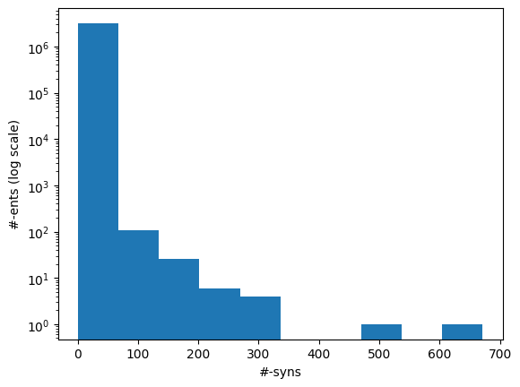

Inputs to our model(s) are either pairs of synonyms belonging to the same entity (positive pairs) or triples of (anchor, positive, negative) triples where the first two synonyms belong to the same entity and the last belongs to some other entity.

To build the positive pairs, we sample 5000 entities without replacement from the filtered list where the number of synonyms is at least 5 and join with itself on `CUI` to get a list of 628,838 positive pairs. For each entity, we randomly sample 3-5 pairs, resulting in our pair dataset of 19,953 synonym pairs. This is split into a training set of 19,853 and an evaluation set of 100. Further we randomly extract 10 pairs from the evaluation set for visualization.

### Hard Negative Mining

When training on triples, the model benefits if the negatives are "hard", i.e. it is not too easy to distinguish between the positive example and the negative example. We adapt the simple adversarial search approach to hard negative mining described in [Hard-Mining Negatives for Semantic Similarity Model using Sentence Transformers](https://medium.com/@jithinanievarghese/hard-mining-negatives-for-semantic-similarity-model-using-sentence-transformers-c3e271af6c25) (@jithinanievarghese). In this approach, we find synonyms semantically similer to the positive synonym in the (anchor, positive, negative) triple that do not share the same entity id (`CUI`). Semantic similarity is derived based on embeddings done by the BERT model before fine-tuning. For each positive synonym in the triple, we select a variable number of negative synonyms, to create a triples file.

Input to this process is the training split of the positive pairs file, from which we can get the first two elements of the triple. The Hard Negative Mining process described above is used to derive the third component of the triple. We experiment with 1, 3 and 5 negative synonyms per positive pair, giving us datasets of sizes 19,053, 59,957 and 99,261 respectively.

### Training

Training is done using the SentenceTransformers API. We construct an embedding layer using a pre-trained BERT model, a pooling layer that returns a single pooled sentence vector (here the [CLS] token), and a dense layer that projects the pooled vector to a vector of size 768, and wrap the pipeline in a SentenceTransformer. Loss functions used are MNR and Triplet loss. Each model is trained for 10 epochs.

### Evaluation

For evaluation, we generate the cosine similarity of encodings for all pairs of synonyms in our evaluation set. The resulting matrix of similiraty scores would have entries for all (explicit) positive pairs of synonyms along the diagonal, and entries for all (implicit) non-positive pairs in the off-diagonal entries in either the lower or upper triangular matrix. We compute the mean and standard deviation of scores from these two collections, and use this to construct a normal distribution for each collection. We use the difference between the means of these distributions as our quality metric for our fine-tuned model. We also use this information to construct a visualization to show the separation between the two score distributions.

In addition, we construct a heatmap of scores for the smaller sub-sample of 10 evaluation records. A visual indicator of model quality in this case would be darker colors (high similarity scores) for the diagonal elements and lighter colors (low similarity scores) for the off-diagonal elements. This was inspired by work described in [Training Sentnce Transformers the OG Way (with Softmax Loss)](https://www.pinecone.io/learn/series/nlp/train-sentence-transformers-softmax/) (Pinecone).

## Results

The results of the evaluation for the different models are summarized below.

For a baseline, we evaluate the separation between the distribution of similarity scores between positive pairs and non-positive pairs using BERT model before fine-tuning using the UMLS synonym training set. The baseline model is shown as `bert-base-uncased` in the results table.

The `kgnel-bert-mnr` model uses the `bert-base-uncased` model as the embedding model and uses the MNR loss function for fine tuning, whereas the `kgnel-bert-trp` model uses the Triplet loss function. Similarly the `kgnel-bmbert-mnr` and `kgnel-bmbert-trp` uses the BiomedBERT (formerly PubmedBERT) as the base model and MNR and Triplet loss functions for fine-tuning respectively.

The `kgnel-bert-trp-3` and `kgnel-bert-trp-5` models use versions of Hard Negative Mining where we generate 3 and 5 negatives for each positive pair respectively (as opposed to 1 for `kgnel-bert-trp` and `kgnel-bmbert-trp` models).

| MODEL_NAME        | POS_MEAN | POS_SD | NEG_MEAN | NEG_SD | DIFF |
| ----------------- | -------- | ------ | -------- | ------ | ---- |
| bert-base-uncased | 0.800    | 0.146  | 0.264    | 0.277 | 0.536 |
| **kgnel-bert-mnr<sup>[2]</sup>**    | **0.775**    | **0.182**  | **0.048**    | **0.071** | **0.728** |
| kognel-bert-trp   | 0.923    | 0.104  | 0.318    | 0.334 | 0.605 |
| kgnel-bert-trp-3  | 0.937    | 0.083  | 0.333    | 0.346 | 0.604 |
| kgnel-bert-trp-5  | 0.929    | 0.094  | 0.338    | 0.351 | 0.591 |
| **kgnel-bmbert-mnr<sup>[1]</sup>**  | **0.797**    | **0.185**  | **0.043**    | **0.065** | **0.754** |
| kgnel-bmbert-trp  | 0.930    | 0.093  | 0.322    | 0.334 | 0.609 |

### Visualizations

| MODEL NAME        | SCORE DISTRIBUTIONS                          | SCORE HEATMAP                                | DIFF  |
| ----------------- | -------------------------------------------- | -------------------------------------------- | ----- |
| bert-base-uncased | 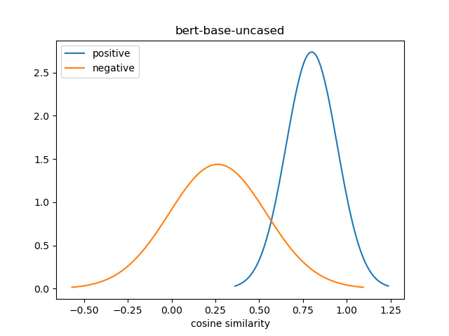 | 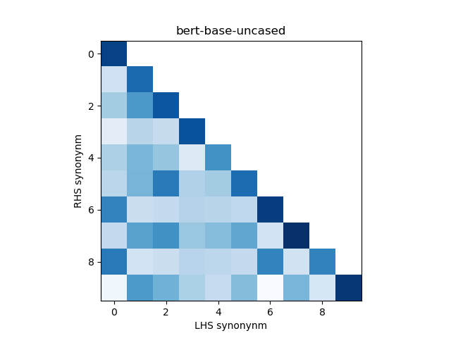 | 0.536 |
| **kgnel-bert-mnr<sup>[2]</sup>**    |    | 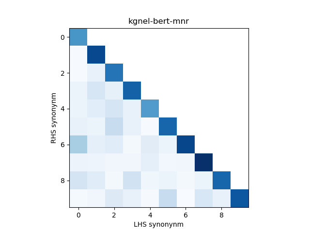    | 0.728 |
| kgnel-bert-trp    | 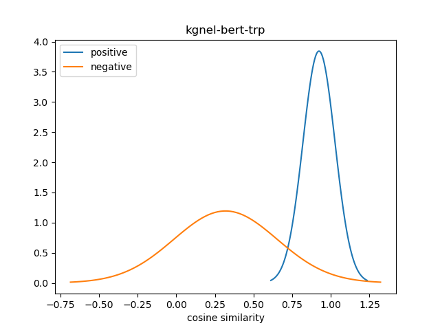   | 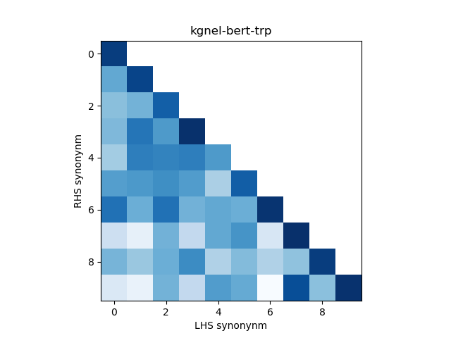    | 0.605 |
| kgnel-bert-trp-3  | 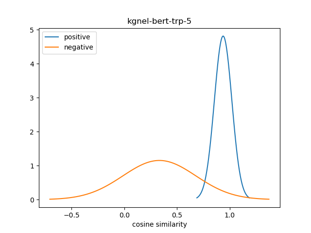  | 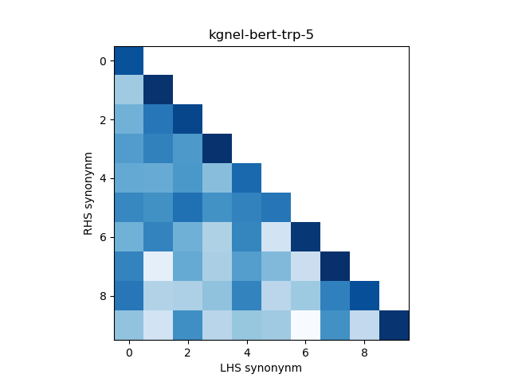  | 0.604 |
| kgnel-bert-trp-5  | 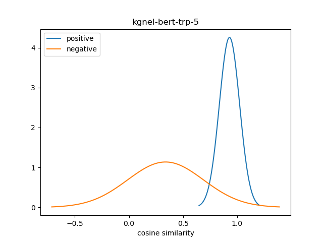  |  | 0.591 |
| **kgnel-bmbert-mnr<sup>[1]</sup>**  | 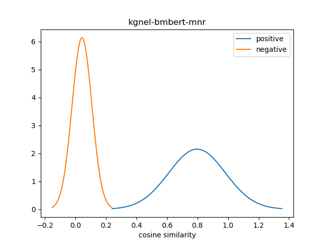  | 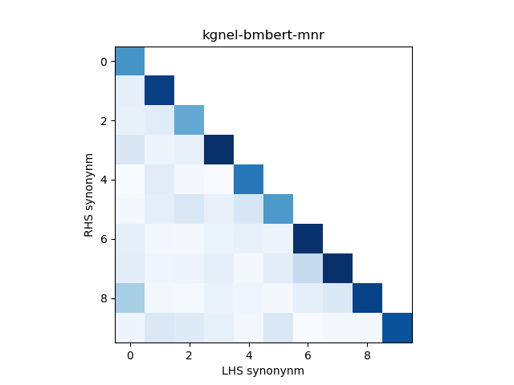  | 0.754 |
| kgnel-bmbert-trp  | 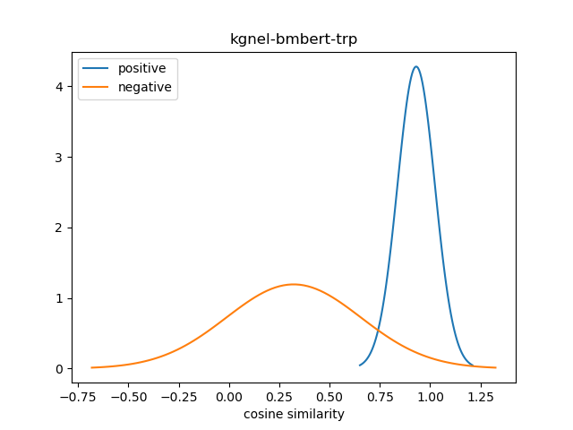  | 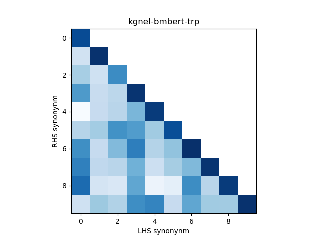  | 0.609 |
 
## Discussion

Our results concur with the results from the SapBERT paper and finds the MNR loss to be more effective at encoding the synonym similarity. In addition, we find that a pre-trained transformer model that is previously fine-tuned on medical literature (`BiomedBERT`) is more effective than one that is not, which is also consistent with our priors.

Somewhat to our surprise, we find that the performance of models fine-tuned with TripletLoss falls as we increase the number of neighbors. The intuition is that TripletLoss offers more control over distinguishing positive pairs vs negative pairs than MNR. However, it is likely that the Hard Negative Mining technique we are using is too simplistic to compete with MNR.

In retrospect, a better metric for evaluating the effectiveness of the fine-tuned NEL model may be to calculate the area under the normal curves of the two distributions where there is overlap. However, given the visualizations of different model results, the difference of means seems to be an effective measure for the time being. We may decide to revisit this issue for future models.

## Running

This section describes the code and how you can run it to reproduce the results locally.

* `01-explore-preprocess-data.ipynb` -- filters and manipulates the `MRCONSO.RRF` file from UMLS to produce a TSV dataset of positive pairs.
* `01-split-trainset.py` -- splits the `positive_pairs.tsv` file into a `positive_pairs_train.tsv` and `positive_pairs_test.tsv` files, and sub-samples the second file to create `positive_pairs_viz.tsv` file. Called without parameters.
   ```
   python 01-split-trainset.py
   ```
* `02-vectorize-sampled-syns.py` -- instantiates a QDrant collection ([setup instructions](https://qdrant.tech/documentation/quick-start/#)) and uses the `bert-base-uncased` model to encode synonyms from the `positive_pairs_train.tsv` file and write them to the collection. Called without parameters.
  ```
  python 02-vectorize-sampled-syns.py
  ```
* `03-hard-neg-mining.py` -- finds synonyms in the QDrant collection that are semantically similar (via cosine similarity between embeddings) to the positive synonym in the `positive_pairs_train.tsv`. Writes out a `num_neighbors` number of triples in the form (anchor, positive, negative). 
  ```
  python3 03-hard-neg-mining.py --num_neighbors N  // N = 1, 3, 5
  ```
* `04-train-nel-st.py` -- sets up a Sentence Transformers model using the provided BERT model and the loss function, writes out fine-tuned model to output folder.
  ```
  python 04-train-nel-st.py \
     --input model-name \  // model name (single or HF-style) or path
     --loss trp \          // loss function: MNR (mnr) or Triplet (trp)
     --output /path/to/fine-tuned-model \
     --triple-nn 5         // triplet-loss only: number of neighbors
  ```
* `05-eval-nel-st.py` -- generates encodings from the fine-tuned model and computes similarity between (explicit) positive pairs and (implicit) non-positive pairs, writes out summary results to STDOUT and builds distribution visualization.
  ```
  python 05-eval-nel-st.py --model model_name_or_path
  ```
* `06-viz-nel-st.py` -- generates encodings from the fine-tuned model and generates heatmap of similarities for visualization subsample.
  ```
  python 06-viz-nel-st.py --model model_name_or_path
  ```

