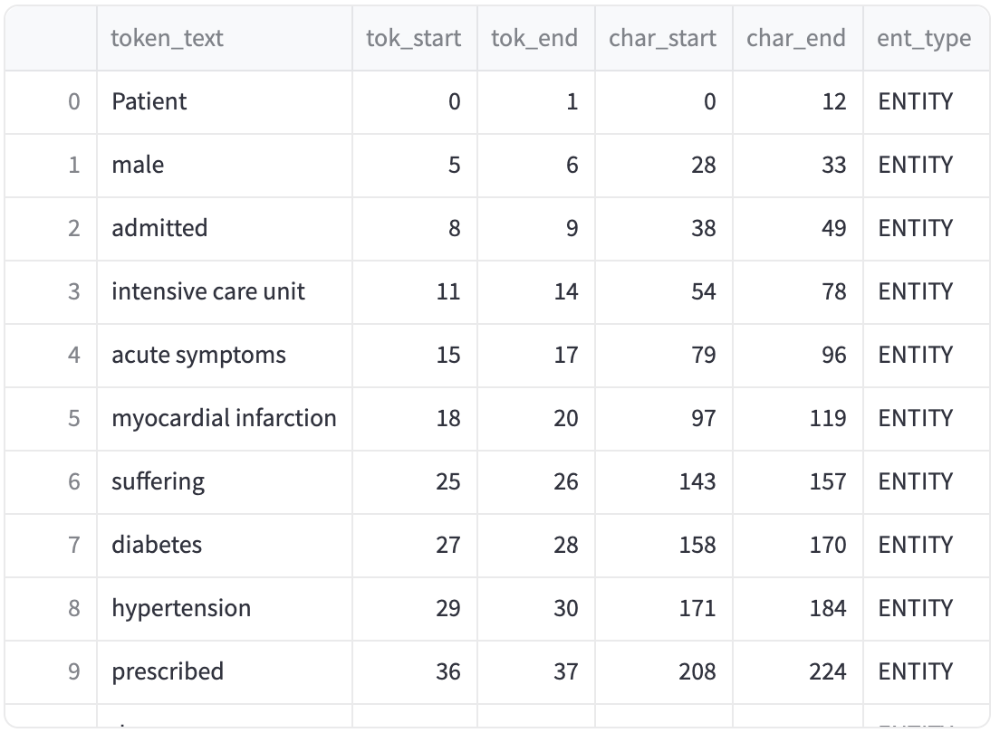
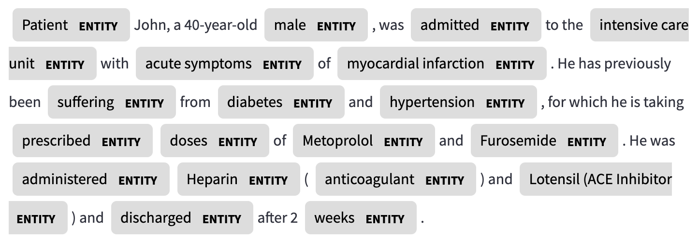
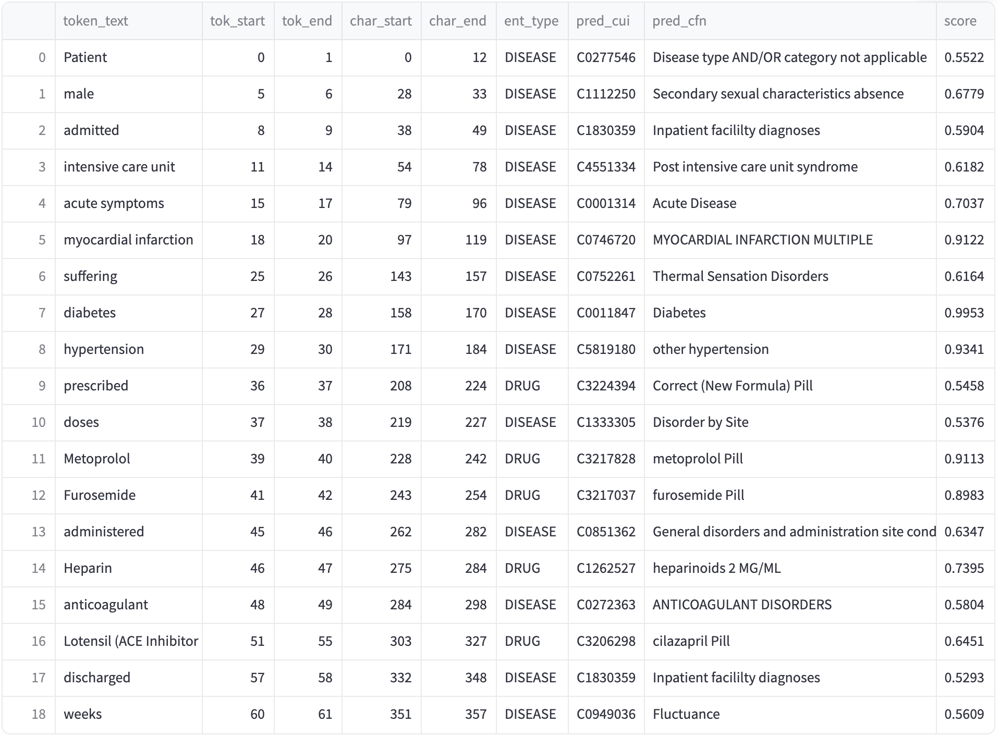
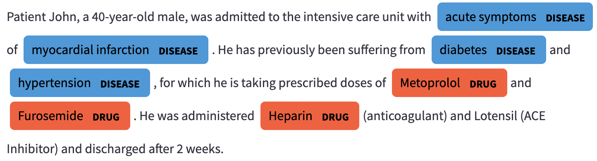

## Named Entity Recognition and Linking (NERL) Demo

The demo shows a pipeline of an off-the-shelf Named Entity Recognition trained to recognize medical phrases (`en_core_sci_sm` model from the [SciSpacy](https://allenai.github.io/scispacy/) project) followed by our best Knowledge Graph Aligned model (`kgnel-bmbert-mnr`) to link the Named Entities to the appropriate entity.

The Named Entity Recognition (NER) model simply takes in text and outputs spans of text it recognizes as medical phrases. It does not attempt to link them to specific Knowledge Graph entities. Trying to do so for more than a few classes is generally not practical.

The Named Entity Linking (NEL) model would try to link each phrase identified by the NER model to an entity in the Knoeledge Graph it was aligned against, in our case the [Unified Medical Language System (UMLS)](https://www.nlm.nih.gov/research/umls/index.html). The NEL model has learned an encoding where synonyms for the same entity are pushed closer together, hence the linking process consists of mapping the encoding of the incoming phrase to the closest entity encoding.

### Pre-requisites

The linking process involves encoding the input phrase and doing a lookup against a vector database contining embeddings of various Knowledge Graph Entities. The vector database is pre-populated with centroids of synonym encodings for each entity (identified by `CUI`). For convenience of setting up the demo, we have chosen to pre-populate encodings for entities that are `DISEASE` (`Disease or Syndrome`) and `DRUG` (`Clinical Drug`).

To set this up, we need to download the `MRSTY.RRF` file from UMLS, in addition to the `MRCONSO.RRF` file we have used for training, then runthe following command. This will write out the selected UMLs `DISEASE` and `DRUG` entities into a JSON-L file.
```
$ python 01-drug-disease-syns-to-json.py
```

We then populate the [QDrant vector store](https://qdrant.tech/) that we will to look up phrase embeddings created by our NEL model. To do this, set up a Docker instance of the QDrant vector store using the following commands:
```
$ docker pull qdrant/qdrant    # one time
$ docker run -p 6333:6333 -p 6334:6334 \
    -v $(pwd)/qdrant_storage:/qdrant/storage:z \
    qdrant/qdrant
$ python 02-gen-vectors-to-index-qdrant.py
```

This will set up a `qdrant_storage` directory under the location where it was invoked (in our demo we used the `data` directory) and populate it with centroids of the synonym embeddings for each `DISEASE` and `DRUG` entity in UMLS.

We then run the [Streamlit](https://streamlit.io/) code which allows us to enter a block of text and have it be annotated by the NER model, each of which is then linked to the closest `DRUG` or `DISEASE` entity by the NEL model. Because we are only considering a subset of entity types, we use a threshold (0.7) to exclude any matches where the cosine similarity between the phrase embedding and the best entity centroid.

```
$ streamlit run 03-run-demo.py
```

The demo is then accessible via port forwarding on your local machine on port 8501 ([http://localhost:8501])

### Screenshots

The following images show screenshots of outputs produced in the demo application for some example input.

#### Input

> Patient John, a 40-year-old male, was admitted to the intensive care unit with acute symptoms of myocardial infarction. He has previously been suffering from diabetes and hypertension, for which he is taking prescribed doses of Metoprolol and Furosemide. He was administered Heparin (anticoagulant) and Lotensil (ACE Inhibitor) and discharged after 2 weeks.


#### NER Output (Tabular)



#### NER Output (Rendering)



#### NEL Output (Tabular)



#### NEL Output (Rendering)



